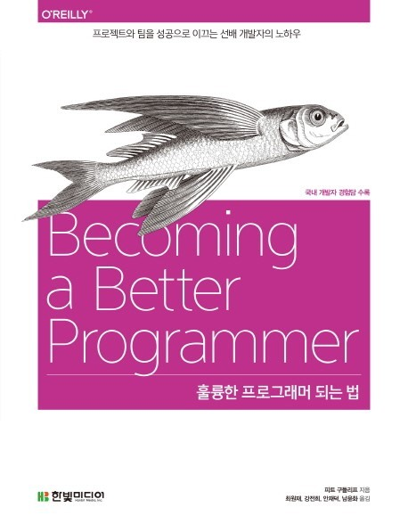

# 훌륭한 프로그래머 되는 법

|||
|:------:|:---:|
|제목|훌륭한 프로그래머 되는 법|
|저자|피트 구들리프|
|역자|최원재, 강전희, 안재덕|
|출판사|한빛미디어|
---
## 책 선정 이유
  동물책(O'REILLY에서 나온 동물이 표지에 포함되어 있는 책)을 둘러보다 이번엔 물고기가 표지에 있는 훌륭한 프로그래머 되는 법이라는 너무나 끌리는 제목의 책을 선택했다.

  컴퓨터계열 전공 4학년 과정을 거치면서 소프트웨어 공학이라는 과목 이외에서는 코드의 중요성을 알려준 과목은 없었다. 소프트웨어 공학에서도 유지 보수를 위해 적절한 형식을 정하고 남들과 일해야 한다는 내용이 간략하게 나왔고 어떤 방식으로 작성해야한다거나 어떤 방식으로는 작성해서는 안된다는 내용은 따로 없었다.  

  대학 과정에서 조금씩 스스로 찾아본 내용이 전부라 이번 기회에 처음부터 처음부터 배워보고자 이 책을 읽어보고자 한다.

---
## CHAPTER01 코드에 신경쓰기
  좋은 프로그래그래머가 되고자 한다면 좋은 코드를 작성하기 위해 많은 노력을 기울여야 한다. 단순히 작동하는 코드가 아닌 올바르게 작동하는 효율적인 코드가 필요하다.  

  코드를 수정하는 경우는 이전 코드보다 개선되어야 한다.  
  더 나은 구조 / 더 나은 테스트 / 더 쉬운 이해 등

### Question
1. 코드에 신경 쓰는가? 자신이 만든 결과물에서 그 점이 어떻게 드러나는가?
   - 기능별 함수 작성
   - 변수명 용도에 맞게 선택
2. 프로그래머로서 더 나아지고 싶은가? 가장 노력해야 하는 부분은 어떤 부분인가?
   - 영어 공부하기
   - 과거에 작성했던 코드 개선해보기
   - 다른 사람이 작성한 잘 짜놓은 코드 읽어보기
3. 코드에 신경쓰지 않는다면, 왜 이 책을 읽고 있는가?
   - 해당 사항 없음
4. 이 장의 서두에 등장하는 '좋은 프로그래머가 좋은 코드를 작성한다는 것은 셜록 홈즈가 아니더라도 알 수 있는 뻔한 사실이다. 나쁜 프로그래머의 경우는 그렇지 않다.'는 문장은 얼마나 정확한가? 좋은 프로그래머가 나쁜 코드를 만들 수도 있는가? 어떻게 그럴 수 있는가?
   - 좋은 프로그래머는 좋은 코드를 작성하기 쉽지만 나쁜 프로그래머는 좋은 코드를 만족하는 여러가지 조건을 모두 만족하면서 작성하기는 어렵다는 말로 이해함
   - 따라서 대체로 올바른 표현이라고 생각함

---
## CHAPTER02 정돈된 코드 유지하기
  '탭 vs 스페이스' 같은 의미없는 논쟁에서 벗어나 코드 설계 및 레이아웃 등 넓은 관점에서 코드를 살펴보고 평가해보자.

코드를 작성할때 컴파일러만 만족시키는건 너무나 쉬운 일이다. 컴파일러 이외에도 우리는 자신과 동료를 위해 명백한 레이아웃을 통해 코드를 작성해야한다.

* 현재 코드를 작성하고 있는 나
* 몇 주 후에 소프트웨어를 배포를 준비할 나
* 코드를 검토하고 통합해야하는 동료
* 미래에 코드 유지 보수할 동료

class, method, variable 명명시 불필요한 반복은 피하고 명확하며 정확하게 명명하라.

항상 코드를 스스로 가다듬고 정돈하라. commit의 경우에도 하나의 주제로만 commit하고 두 가지 행동을 동시에 commit 하지말자.

### Question
1. 회사의 코딩 표준에 맞추기 위하여 레이아웃을 바꿔야 하는가? 아니면 원작자의 스타일을 구냥 두는 것이 나은가? 그렇다면 이유는 무엇인가?
    - 회사의 코딩 표준 레이아웃으로 통일하는게 바람직함
    - 협업시 통일되지 않은 개개인의 레이아웃 스타일의 코드를 읽어보는 것도 많은 시간이 소요됨
2. 코드를 리포매팅해주는 도구는 중요한가? 도구는 당신이 사용하는 언어에 얼마나 의존적인가?
    - 리포매팅 도구가 필요하다고 생각함
    - 의존적성이 낮긴하지만 필요하다고 생각함
4. 코드의 외관과 설계 중 어떤 것이 더 중요한가?
    - 코드의 설계가 더 중요함
    - 제대로된 설계에 깔끔한 외관을 갖춘 코드가 좋은 코드라고 생각함
5. 현재 프로젝트에서 코드의 일관성은 어떠한가? 어떻게 개선할 수 있는가?
    - 참여해본 팀 프로젝트에서는 같은 리포매팅 도구를 사용하여 일관성을 유지한 경험이 있음
    - 큰 규모의 팀 프로젝트를 참여해본다면 생각해볼 예정
6. 탭 vs 스페이스? 선택한 이유는? 이것은 중요한가?
    - 탭 키보드를 한번만 누르면 되기 때문에 간편하기 때문
    - 전혀 중요하지 않고 프로젝트에서 일관성 유지가 중요
7. 언어의 레이아웃과 명명 규칙을 따르는 것이 중요한가? 아니면 표준 라이브러리와 차별화하여 '자신만의 스타일'을 사용하는 것이 유용한가?
    - 사용하는 언어의 레이아웃과 명명 규칙을 반듯이 따라야한다고 생각함
    - '자신만의 스타일'은 협업시 도움이 되지 않고 오히려 마이너스 요소임
8. 화려한 구문 강조 코드 편집기를 사용하면 색상이 코드의 구조를 나타내준다는 이유로, 코드의 레이아웃에 대해 신경쓰지 않아도 될까?
    - 레이아웃과 코드 편집기 색 변경 툴은 전혀 다른 의미라고 생각함
    - 레이아웃 구분은 단순히 색 구분 이상의 의미가 있기 때문